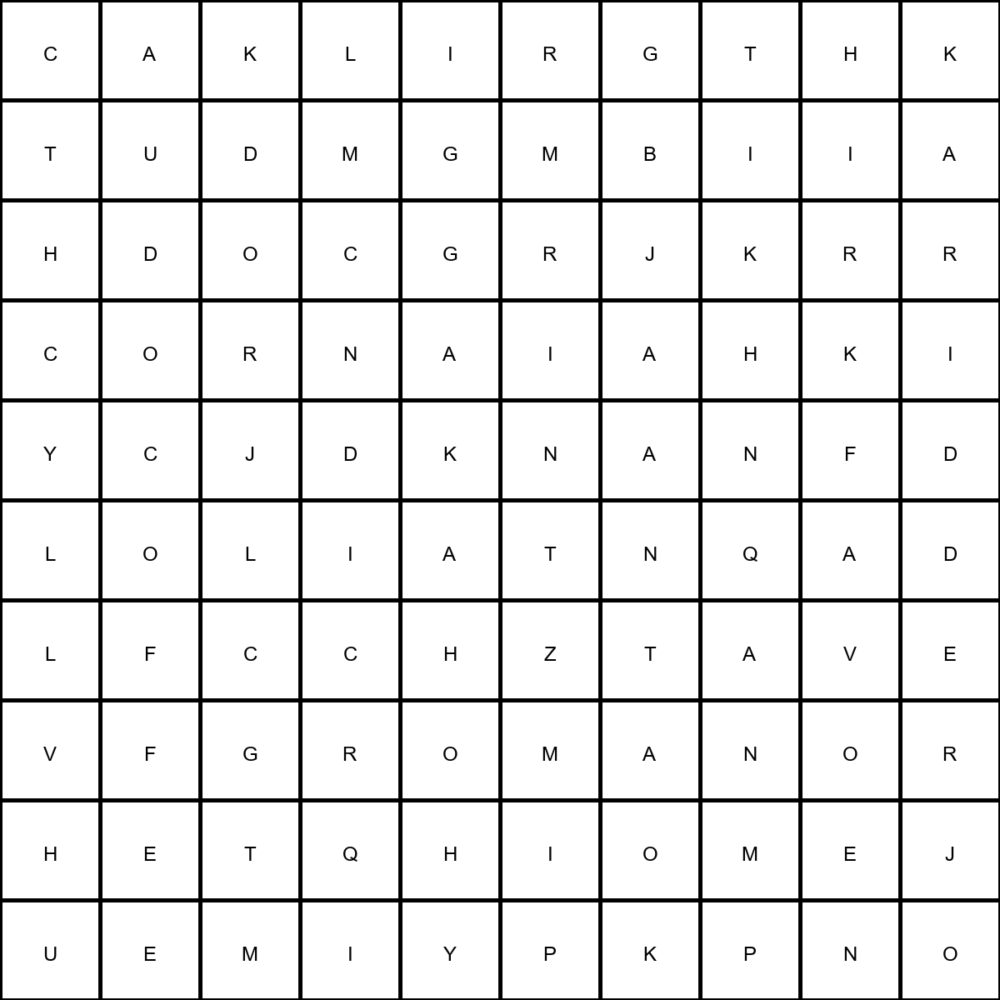
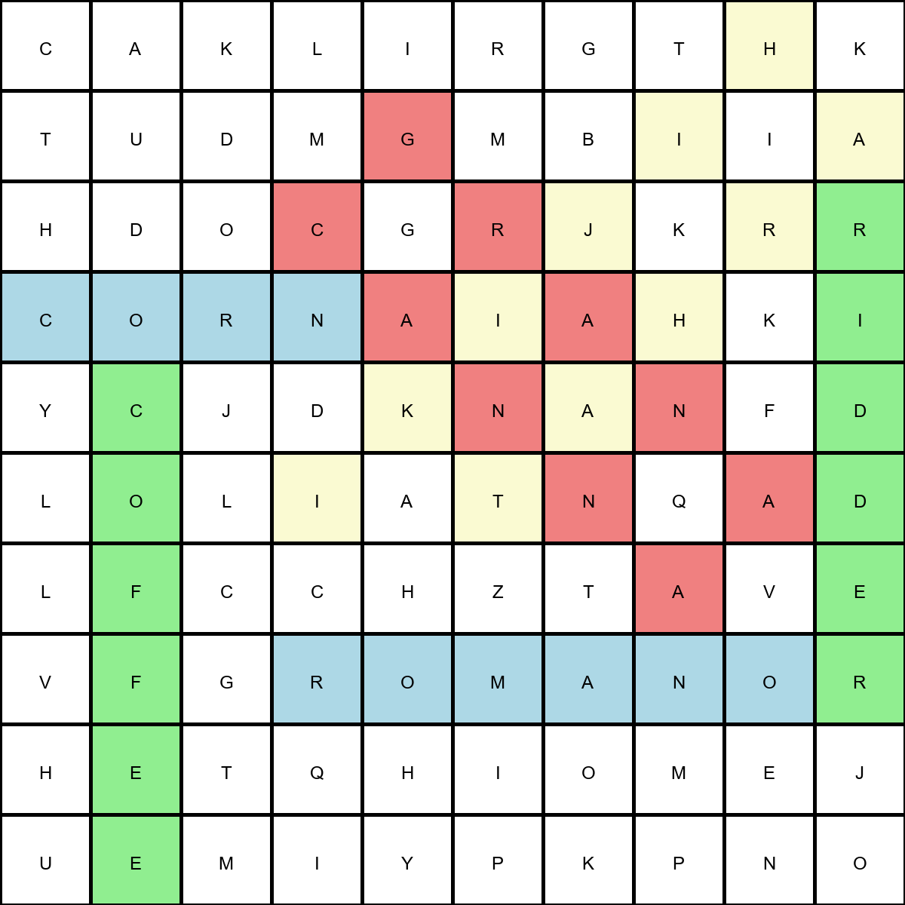
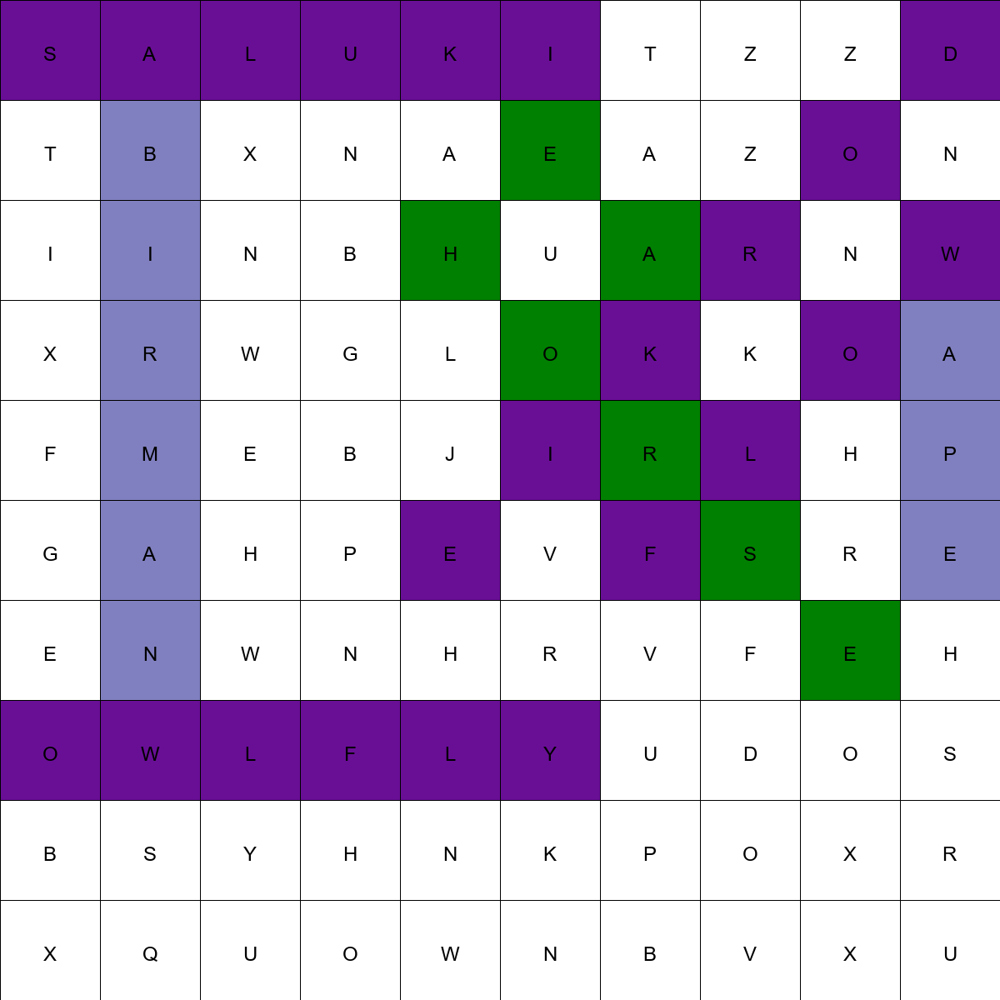
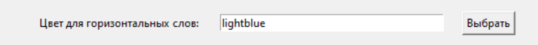

# Мануал для использования программы генерации филвордов

## Описание программы

Программа генерации филвордов предназначена для создания головоломок, в которых слова расположены в сетке и могут быть найдены по горизонтали, вертикали, диагонали и анти-диагонали. Пользователь может загрузить файл со словами, выбрать размер сетки и количество головоломок для генерации. Программа автоматически удаляет дубликаты слов и слова в скобках, оставляя только уникальные слова для создания головоломок.

### Что будет создано и зачем

- **Головоломки**: Программа создаст заданное количество головоломок в виде изображений, где слова спрятаны в сетке из букв.
- **Списки слов**: Для каждой головоломки будет создан список слов, которые нужно найти.
- **Файлы головоломок и решений**: Каждая головоломка будет иметь два изображения: одно с зашифрованными словами, второе с отмеченными решениями.

### Пример изображения головоломки:


### Пример изображения с решениями:


### Пример изображения с измененными цветами:


## Возможные изменения и их назначение

### Изменение цветов для направлений слов

Вы можете изменять цвета, которые будут использоваться для выделения слов, спрятанных по горизонтали, вертикали, диагонали и анти-диагонали.

1. Нажмите кнопку "Выбрать" рядом с полем "Цвет для горизонтальных слов".
2. В открывшемся окне выберите нужный цвет и нажмите "ОК".



## Инструкции по использованию

### Запуск программы

1. Убедитесь что все данные заполнены

2. Запустите программу, нажав создать головоломку.

### Добавление файлов со словами

Чтобы добавить файл со словами, следуйте этим шагам:

1. Нажмите кнопку "Обзор" рядом с полем "Загрузите файл со словами".
2. Выберите текстовый файл, содержащий список слов, и нажмите "Открыть". Программа прочитает файл и покажет сообщение о количестве загруженных слов.
3. Убедитесь, что файл со словами имеет правильный формат: каждое слово должно быть на отдельной строке.

### Пример текстового файла со словами:
```
apple
banana
orange
strawberry
grape
```

### Выбор параметров генерации

1. Укажите количество головоломок в поле "Количество головоломок".
2. Выберите размер сетки из выпадающего списка "Размер сетки".
3. Укажите папку для сохранения сгенерированных головоломок, нажав кнопку "Обзор" рядом с полем "Папка для сохранения".

### Генерация головоломок

1. Нажмите кнопку "Создать головоломки".
2. Программа создаст указанное количество головоломок и сохранит их в выбранную папку. В каждой головоломке слова будут расположены так, чтобы заполнить всю сетку, и будут использоваться все направления размещения.

### Выход из программы

После завершения работы вы можете закрыть программу, нажав на крест в правом верхнем углу окна.
